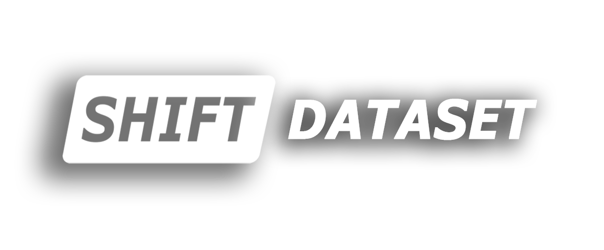

<div align="center">
  
  <div>&nbsp;</div>
  <div align="center">
    <a href="https://www.vis.xyz/shift/">
    <b><font size="5">[SHIFT]</font></b>
    </a>
    &nbsp;&nbsp;&nbsp;&nbsp;
    <a href="https://wvcl.vis.xyz/challenges">
    <b><font size="5">[Continual Test-time Adaptation Challenge]</font></b>
    </a>
    &nbsp;&nbsp;&nbsp;&nbsp;
    <a href="https://wvcl.vis.xyz">
    <b><font size="5">[Visual Continual Learning @ ICCV2023]</font></b>
    </a>
  </div>
  <div>&nbsp;</div>
</div>

# Continuous Test-Time Adaptation on SHIFT Dataset

This offcial demo provides a benchmark for test-time adaptation of semantic segmentation containing some prominent methods.

## Environment setup
Please make sure that conda or miniconda is installed on your machine before running the following command:

- Create a conda environment and activate it:
    ```
    conda create -n SHIFT_CTTA python=3.8
    conda activate SHIFT_CTTA
    conda install pytorch==1.7.1 torchvision==0.8.2 torchaudio==0.7.2 cudatoolkit=10.2 -c pytorch
    ```

- Install mmcv-full, you can change the CUDA version to yours:
    ```
    wget https://download.openmmlab.com/mmcv/dist/cu102/torch1.7.0/mmcv_full-1.2.7-cp38-cp38-manylinux1_x86_64.whl
    pip install mmcv_full-1.2.7-cp38-cp38-manylinux1_x86_64.whl
    ```

- Install mmsegmentation and other dependencies
    ```
    pip install -v -e .
    pip install -r requirements.txt
    ```


## Download SHIFT dataset

You can download the SHIFT dataset using the download script in [shift-dev](https://github.com/SysCV/shift-dev). Please follow the instructions below:

```shell
mkdir -p ./data/shift

# Download the continuous shift set for test-time adaptation
python download.py \
    --view "[front]" --group "[img, semseg]" \
    --split "[train, val, test]" --framerate "[videos]" \
    --shift "continuous/1x" \
    ./data/shift
```


## Run from pretrained models

You are able to download the pretrained models and run the evaluation scripts directly.

- Download the pretrained source model [iter_40000.pth](https://drive.google.com/file/d/1J7a8k-XBi9LGNhciOw5xzmQ-GAb-tff6/view?usp=sharing).
- Configure the dataset path for files in `local_configs/`. There are two settings for different dataset split: `shift_val_800x500.py`, `shift_train_800x500.py`.
- The following commands run different methods. Note that they are tested on the  `continuous/val/1x/front` data. You can change the dataset path in `local_configs/` to run on other splits.
    ```shell
    bash run_base.sh    # source model without adaptation
    bash run_tent.sh    # TENT
    bash run_cotta.sh   # CoTTA
    ```

<!-- - for *SHIFT_continuous_videos_1x_train_front*,
modify config path 'shift_train_800x500.py' to 'shift_val_800x500.py'  -->


## Train your own source model
-  Refer to [SHIFT-TTA-train_source_model](https://github.com/zwbx/SHIFT-TTA-train_source_model)


## Guide: How to adapt to newer mmsegmentation versions?

Since there are some changes in the mmsegmentation codebase from time to time, we provide a guide to adapt our code to newer versions.

This example repo is based on mmsegmentaion version 0.17. To adapt to your own codebase, you need to modify the following parts. You can refer the corresponding files in this repo for more details.

<details>
<summary>
<b>Dataloader</b>
</summary>

We need to define each sequence as an independent dataset in mmsegmentation. 
- tools/{tent,test,cotta}.py

    ```
    # select sequence
        with open(seq_info_path, 'r') as file:
            reader = csv.reader(file)
            next(reader) # skip header row
            for row in reader: 
                if True:# condition that filters seq. e.g. row[0]=='.....'
                    seq_id_list.append(row[0])

    # define config for each sequence
        seq_cfg_list =[]
        for i, seq in enumerate(os.listdir(os.path.join(cfg.data.test.data_root,cfg.data.test.img_dir))):
            if seq in seq_id_list:
                globals()["cfg.data.test{}".format(i)] = deepcopy(cfg.data.test)
                globals()["cfg.data.test{}".format(i)].img_dir = os.path.join(cfg.data.test.img_dir,seq)
                globals()["cfg.data.test{}".format(i)].ann_dir = os.path.join(cfg.data.test.ann_dir,seq)
                seq_cfg_list.append(globals()["cfg.data.test{}".format(i)])

    # build dataset and dataloader
        datasets = [build_dataset(seq) for seq in seq_cfg_list]#, build_dataset(cfg.data.test1), build_dataset(cfg.data.test2),build_dataset(cfg.data.test3)]
        data_loaders = [build_dataloader(
            dataset,
            samples_per_gpu=1,
            workers_per_gpu=cfg.data.workers_per_gpu,
            dist=distributed,
            shuffle=False) for dataset in datasets]
    ```

- mmseg/datasets/shift.py
    ```
    img_infos = []
    if split is not None:
        with open(split) as f:
            for line in f:
                img_name = line.strip()
                img_info = dict(filename=img_name + img_suffix)
                if ann_dir is not None:
                    seg_map = img_name + seg_map_suffix
                    img_info['ann'] = dict(seg_map=seg_map)
                img_infos.append(img_info)
    else:
        for img in mmcv.scandir(img_dir, img_suffix, recursive=True):
            img_info = dict(filename=img)
            if ann_dir is not None:
                seg_map = img.replace(img_suffix, seg_map_suffix)
                img_info['ann'] = dict(seg_map=seg_map)
            img_infos.append(img_info)
    print_log(f'Loaded {len(img_infos)} images', logger=get_root_logger())
    # note that sort the squence to conduct contintual test-time adaptation
    img_infos_sorted = sorted(img_infos, key=lambda x: x['filename'])[:2]
    return img_infos_sorted 
    ```

</details>

<details>
<summary>
<b>Evaluator</b>
</summary>
The evaluation should follow the following steps: 

1. Test each sequence independently to obtain mIoU and mAcc on each category. 
2. Calculate the average of all sequences for each category. 
3. Calculate the overall average.

- tools/{tent,test,cotta}.py
after *dataset.evaluate* on each sequence, we store the results into a json file. Finally, *res_process()* aggregate all the results of each sequence and outoput the last evaluation results.
    ```
            if args.eval:
                _, eval_res,_ = dataset.evaluate(outputs, args.eval, **kwargs)
                out_dir = './Test_on_{}/tent_eval/'.format(cfg.data_split_type)
                if not os.path.exists(out_dir):
                    os.makedirs(out_dir + 'res')
                mmcv.dump(eval_res, out_dir + 'res/{}.json'.format(seq_name), indent=4)
    res_process(out_dir,cfg.csv_root)
    ```

Note that evaluation for each sequence requires reloading pretrained parameters of source model.


- tools/res_process.py
    ```
    def res_process(res_path,csv_root,in_domain=False):
            # Initialize the dictionary
        json_dict = {}
        seq_path = os.path.join(res_path,'res') 
        # Loop over all files in the path
        for file_name in os.listdir(seq_path):
            # Check if the file is a JSON file
            if file_name.endswith(".json"):
                # Extract the sequence ID from the file name
                seq_id = file_name.split(".")[0]
                # Read the JSON file
                with open(os.path.join(seq_path, file_name), "r") as f:
                    content = json.load(f)
                # Append the content to the dictionary
                json_dict[seq_id] = content # json dict 
                ...
    ```
</details>

## License
Non-commercial. Code is heavily based on Cotta, MMSegmentaion 0.11. 

